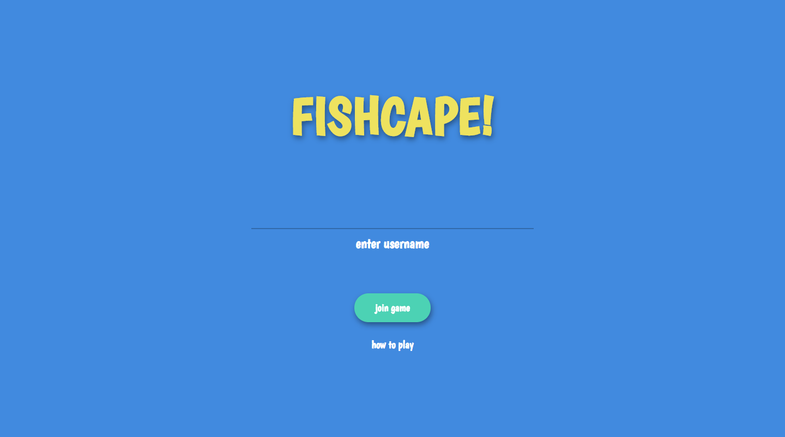
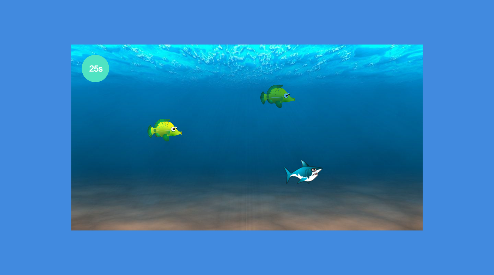

# Fishscape

FISHSCAPE! is a real-time multiplayer web action game that offers two ways to enjoy! Each player will be entered into an ocean scenario where one randomly selected player will be created as the villainous shark whose main objective is to rid his kingdom of pesky annoying fish while at the same time feeding his hunger! The remaining players will be created as fish, in which their main objective is to escape the menacing teeth of the shark, while outlasting the time limit to be crowned the fittest, smartest, and last surviving fish of his school!

[Live Demo](https://fishscape.herokuapp.com/) - Design by [@ehzdesign](https://github.com/ehzdesign)





## Install package

```bash
$ npm install
```

## Run it

```bash
$ npm start
```

## Fishscape is inspired or powered by:

* [Phaser](https://phaser.io/)

* [Socket.io](https://socket.io/)

* [Phaser-multiplayer-game](https://github.com/xicombd/phaser-multiplayer-game)
